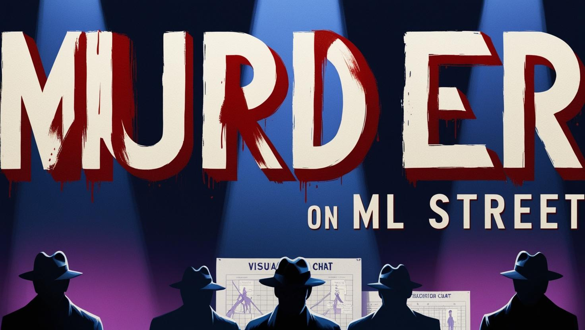

# Week 7 Dev Friday: Murder Mystery (Classification, Regression, Trees, Random Forests)

## TRAGEDY AT MACHINE LEARNING MANOR:
 Professor Reginald "Regressor" Fisher has been found dead in his study, struck by a vintage calculating machine during the Statistical Learning Conference. Eight suspects were present during the estimated time of death. The investigation will require branching out beyond obvious patterns, as the roots of this crime may run deeper than initial models suggest.

## Team Members and Contributions

- **Member 1**: [Name]  
  *Specific contribution/part they worked on*

- **Member 2**: [Name]  
  *Specific contribution/part they worked on*

- **Member 3**: [Name]  
  *Specific contribution/part they worked on*

- **Member 4**: [Name]  
  *Specific contribution/part they worked on*

- **Member 5**: [Name]  
  *Specific contribution/part they worked on*

---

## Case Closed: Conclusions

### Team Final Report

1. **The Culprit**: [Who your team believes committed the murder]

2. **Key Evidence**: [What evidence led you to this conclusion]

3. **Model Analysis**: [Why some models may have identified the wrong suspect]

4. **Learning Outcomes**: [What this teaches us about the strengths and weaknesses of different machine learning approaches]